```{r setup, include=FALSE}
knitr::opts_chunk$set(echo = TRUE, fig.align = 'center')
```

## 0. Enunciado

El objetivo de esta entrega es implementar un algoritmo evolutivo para la elaboración de  horarios  en  un  centro  educativo. Para ello:

1) Estableced cuáles son las restricciones soft y hard de vuestro algoritmo y justificadlas.

2) Explicad claramente cuál es la codificación usada, cuáles son los parámetros del algoritmo y su función de fitness. Justificad su elección.

3) Cread varias entradas con distintos grados de dificultad y analizad los resultados obtenidos.Podéis utilizar como entrada listas de asignaturas y sus horas semanales de distintos cursos de secundaria y bachillerato.

4) Proponed alguna modificación al algoritmo y analizad los resultados obtenidos. Esta modificación puede ser un nuevo operador de mutación o recombinación,una nueva estrategia de selección de los individuos de la nueva generación, etc.


## 1. Restricciones *hard* y *soft*

Un comentario preliminar es que, aunque el enunciado hable de secundaria y bachillerato, algunas de nuestras restricciones contemplan escenarios que son probables en el ámbito universitario, pero improbables en un instituto, por ejemplo, que una clase tenga un día libre en la semana. Pese a esto, hemos querido incorporarlas en el algoritmo para darle más flexibilidad y comprobar cómo se comporta cuando hay muchas horas libres. Por tanto, en adelante se ha de suponer que el algoritmo está pensado para cualquier tipo de centro educativo, incluyendo la universidad.

Las **restricciones *hard*** del algoritmo son las siguientes:

1. **No se pueden asignar horas a un profesor fuera de su disponibilidad**. Por motivos de conciliación laboral esta restricción debe estar presente. La restricción se tiene en cuenta mediante la función de *fitness* y se computa comparando con un horario de disponibilidad que proporciona cada profesor. Estos horarios de disponibilidad forman parte de los *inputs*.

1. **No se pueden asignar dos asignaturas a la vez a la misma clase**. Esta restricción debe estar presente por razones obvias. La restricción se satisface implícitamente mediante el algoritmo de inicialización de los individuos, ya que en cada franja únicamente se asigna una única asignatura.

1. **No se pueden asignar dos clases a la vez al mismo profesor**. Esta restricción debe estar presente por razones obvias, y se tiene en cuenta mediante la función de *fitness*.

1. **Se debe asignar el número de horas exacto de asignaturas a cada clase**, ni más ni menos horas. Esta restricción debe estar presente por razones obvias. La restricción se satisface implícitamente mediante el algoritmo de inicialización de los individuos, ya que asigna todas las horas a cada clase. Por tanto, no será necesario que se tenga en cuenta en la función de *fitness*. El número de horas de cada clase viene dado por los *inputs*.

1. **Las asignaturas se deben asignar al profesor definido en los *inputs,*** aunque haya otros profesores que impartan esa asignatura a otra clase. Entendemos que esto tiene que ser una restricción *hard* puesto que, aunque haya profesores que den la misma asignatura, puede haber muchas razones por las que no sean intercambiables para una clase concreta (ej. distinto curso, necesidad de que el tutor de un mínimo número de horas a sus tutorandos, etc). Esta restricción se satisface implícitamente mediante la codificación del genotipo, tal como explicamos más adelante. 

1. En los casos en los que el número de horas semanales de clase es inferior al número total de horas disponibles en el horario lectivo, **las clases no pueden tener horas vacías entre medias** pero sí pueden tener horas vacías al principio y al final de la jornada. Tratar esta restricción como *hard* busca generar soluciones en los que los alumnos no tengan ninguna hora vacía ya que esto no es nada deseable ni desde el punto de eficiencia para el alumno, ni desde el punto de vista organizativo para el centro (por ejemplo, habría que habilitar espacios para que estén los alumnos, profesores que los vigilen, etc). La restricción se tiene en cuenta mediante la función de *fitness*.

1. **Únicamente se podrá dar clase dentro del horario lectivo** establecido. Está restricción debe estar presente por razones obvias, y se satisface implícitamente mediante el algoritmo de inicialización. El horario lectivo de define en los *inputs*.

Todas las **restricciones *soft*** del algoritmo se tienen en cuanta mediante la función de *fitness*, y son las siguientes:

1. Los **profesores deben tener el menor número posible de horas vacías** entre medias (sí que pueden tener horas vacías al principio y al final de la jornada). Al contrario que en el caso de horas libres para los alumnos, esta restricción la hemos implementado como *soft* porque habrá casos en los que tener profesores con horas libres sea necesario para cuadrar los horarios y porque los profesores pueden aprovechar esas horas para realizar otro tipo de actividades en el centro (ej. evaluación).

1. El número de **horas impartidas por un profesor deben distribuirse lo más uniformemente posible** a lo largo de la semana. Por ejemplo, si un profesor tiene que dar en total 10 horas, es preferible que dé 2 horas cada día a que dé 5 horas en dos días. Esta restricción busca permitir que los profesores puedan conciliar su trabajo en el centro con su vida familiar o con otros trabajos.

1. Si una clase tiene menos horas asignadas que el total de horas lectivas y hay posibilidad de que **las asignaturas se concentren de modo que las clases tenga días libres**, está opción es la deseable. Por ejemplo, si la semana lectiva son 25 horas (5 por día) y una clase tiene 20 horas asignadas, es preferible que tengan un día de la semana completamente libre a que tengan una hora libre cada día. Esta restricción busca dar más tiempo libre a los alumnos al evitar que tengan que ir todos los días al centro si no es necesario.

1. **Las clases no deben tener la misma asignatura más de una vez en el día**. Esta restricción busca hacer la jornada lo más amena posible para los alumnos.

1. Si el número total de horas libres semanales de una clase es tal que tiene que haber **días que combinen horas libres y clase, es mejor que estas horas libres se repartan uniformemente entre todos los días**. Por ejemplo, si la semana lectiva son 30 horas (6 por día) y una clase tiene 20 horas asignadas, la clase tiene 10 horas libres. Por la restricción *soft* #3 es preferible que 6 de esas horas libres se concentren en un día. Pero además, las 4 horas libres restantes es preferible que se repartan entre los otros cuatro días, a que se concentren en un día que tendría 4 horas libres y 2 horas de clase. Esta restricción se tiene en cuenta mediante la función de *fitness*.

Otras dos restricciones *soft* que podrían ser interesante pero que no hemos implementado por limitar la complejidad del problema son: a) que los profesores impartan clase en torno a la misma hora todos los días (ej. siempre por la tarde / siempre por la mañana), para que puedan tener una rutina más fácil de conciliar con otros proyectos; b) que los alumnos no tengan siempre la misma asignatura a la misma hora (en cierta medida esta restricción contraria a la anterior).

## 2. Codificación y algoritmo empleados

### 2.1 Información de entrada

Los *inputs* se introducen en el archivo excel (*Generador inputs horarios.xlsx*), que después es leído por el código que ejecuta el algoritmo en *Python*. La función de este archivo es facilitar la realización de pruebas con distintas informaciones de entrada y hacer algunos "checks" para asegurar que los datos que introducimos tienen una solución posible.

El archivo se divide en 4 secciones. En la sección 0 se introducen los nombres (los *labels*) de los profesores, las clases y las asignaturas. Al hacer esto se introduce implícitamente el número de total de profesores, clases y asignaturas. Además en esta sección se computan algunos datos agregados para comprobar que no hay incompatibilidades (por ejemplo, que a un profesor se le han asignado más horas de las que tiene disponibles)

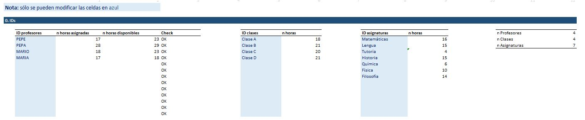

En la sección 1 se introduce, para cada clase, el número de horas semanales por asignatura (si una clase no tiene una asignatura, se asigna un 0) y el profesor que la imparte. Se supone una duración de una hora para todas las asignaturas (por lo que el número de horas tiene que ser un entero).

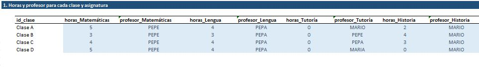

En la sección 2 se introduce la disponibilidad de los profesores a lo largo de la semana. Para reducir los grados de libertad, se introduce a nivel día (en lugar de a nivel hora). Es decir, si los profesores están disponibles un día, lo están a cualquier hora del horario lectivo de ese día. Y viceversa, si no están disponibles, no lo están para ninguna hora de ese día.

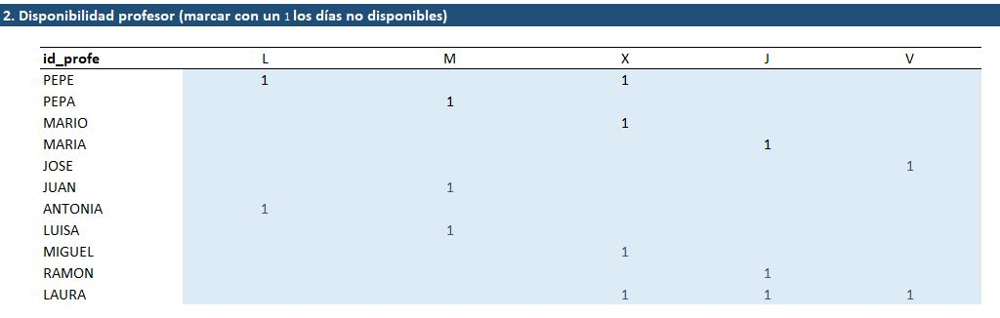

En la sección 3 se introduce el horario lectivo. Es decir, la hora a la que empiezan y acaban las clases cada día de la semana. Para simplificar la implementación y dado que no cambiaría nada en relación a la técnica de resolución empleada, no se han tenido en cuenta recreos.

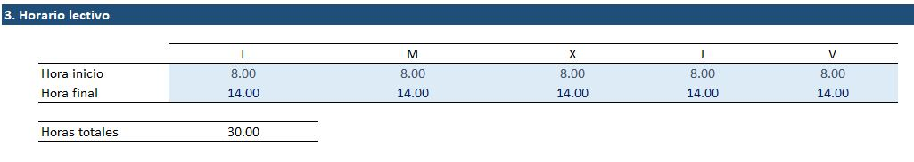

### 2.2 Codificación de la información de entrada

Con la información introducida a través del archivo excel, nuestro programa genera los siguientes elementos:

* *clases* = *['Clase A', 'Clase B', ..., Clase m]*, es una lista de m elementos conteniendo el id de cada clase. Cuando en la notación nos referimos a una clase usando un número *x*, nos referimos a la clase que ocupa el lugar x-ésimo en esta lista.

* *asignaturas* = *['Matemáticas', 'Lengua', ..., Asignatura n]*, es una lista de n elementos conteniendo el id de cada asignatura. Cuando en la notación nos referimos a una asignatura usando un número *x*, nos referimos a la clase que ocupa el lugar *x-ésimo* en esta lista.

* *profesores* = *['Pepe', 'Pepa', ..., Profesor p]*, es una lista de p elementos conteniendo el id de cada profesor. Cuando en la notación nos referimos a un profesor usando un número *x*, nos referimos al profesor que ocupa el lugar *x-ésimo* en esta lista.

* *franjas* = *['Lunes 9.00 - 10.00', Franja t]*, es una lista de t elementos con todas las franjas de una hora que componen el horario lectivo, ordenadas de forma que en primer lugar está la primera hora lectiva del lunes y en último lugar está la última hora del viernes. Cuando en la notación nos referimos a una franja usando un número *x*, nos referimos a la franja que ocupa el lugar *x-ésimo* en esta lista. Por ejemplo, si el horario es todos los días de la semana de 9.00 a 14.00, la franja horaria *5* corresponde al lunes de 13.00 a 14.00, mientras que la franja *6* corresponde al martes de 9.00 a 10.00.

* *Horas_Clase_Asignatura~mxn~*, abreviado como **HCA~mxn~**, es una matriz donde el elemento *ij* es el número de horas asignadas a la clase *i* de la asignatura *j* (*HCA~ij~* valdrá 0 cuando la clase *i* no tenga asignada ninguna hora de la asignatura *j*)

* *Profesor_Clase_Asignatura~mxn~*, abreviado como **PCA~mxn~**, es una matriz donde el elemento *ij* es el profesor que da la asignatura *j* a la clase *i*. Esto es necesario porque una misma asignatura (ej. Lengua) puede ser impartida por los diferentes profesores a diferentes clases (*PCA~ij~* valdrá 0 cuando la clase *i* no tenga asignada la asignatura *j*)

* *Disponibilidad_Profesor_Franja~pxt~*, abreviado como **DPF~pxt~**, es una matriz donde el elemento *ij* representa la disponibilidad del profesor *i* en la franja *j*. Vale 1 si el profesor puede dar clase a esa hora o 0 si no puede.

### 2.3 Genotipo

Para representar cada posible solución (i.e. cada individuo) usaremos la matriz **Genotipo~mxt~**, donde el elemento *ij* representa la asignatura asignada a la clase *i* en la franja *j*.

Nótese que la solución no especifica qué profesor es asignado para dar una determinada asignatura a una determinada clase. Esto es porque vamos a diseñar el algoritmo de modo que al generar una posible solución, el profesor asignado a cada clase-asignatura siempre sea el que corresponde. Al fin y al cabo esto es una condición *hard* que hay que cumplir, y permite simplificar la notación y reducir el tamaño del espacio de búsqueda. 

Asociada a la matriz **Genotipo~mxt~**, en el código también se crea la matriz **Asignatura_Profesor_Franja~pxt~**, abreviado como **APF~pxt~**, en la que el elemento *ij* representa la asignatura asignada al profesor *i* en la franja *j*. Si no hay asignatura asignada, *ij* valdrá 0. Si hay más de una asignatura asignada al profesor *i* en la franja *j*, *ij* valdrá -1. Esta matriz no añade información adicional y se deduce enteramente de la matriz **Genotipo~mxt~**, pero se crea por conveniencia para simplificar ciertos cálculos. 

### 2.4 Inicialización de los individuos

El procedimiento empleado para inicializar un individuo de forma aleatoria es el siguiente:

Mientras (*while*) quede alguna hora de alguna asignatura por asignar a alguna clase, iterar:

|  Para cada clase *c*:
|    Para cada asignatura *a*:
|      Si quedan horas por asignar de la asignatura *a* a la clase *c*:
|        - Se selecciona una franja de una hora aleatoriamente entre todas las franjas pendientes de asignar a *c*
|        - Se asigna la asignatura *a* a *c* en la franja horaria escogida
|        - Se actualiza el valor de horas de asignatura *a* pendientes de asignar a la clase *c*
|        - Se actualiza el valor de franjas de una hora pendientes de asignar a la clase *c*

En *python* cada individuo se crea como una instancia de la clase *Genotipo*. Al inicializar un objeto de tipo *Genotipo*, este ejecuta el método (método en *python* es una función definida dentro de una clase) *generar_genotipo*, que es la función que implementa el procedimiento descrito, devolviendo la matriz *Genotipo~mxt~*´.

### 2.5 Función de fitness

La función de fitness comprueba el cumplimiento de las restricciones que no se satisfacen implícitamente en la codificación del genotipo. En concreto, las restricciones *hard* 1,3 y 6 y todas las *soft*.

Para ello, emplea dos contadores, *contador_hard* y *contador_soft*. Cada violación de una restricción incrementa el contador respectivo. El *fitness* final del individuo será la suma de ambos contadores multiplicados por unos pesos que reflejan que las restricciones *hard* tienen una importancia superior que las soft. En concreto, el multiplicador vale 50 para las restricciones *hard* y 1 para las *soft*.

Estamos por tanto ante un **valor de *fitness* que es menor cuanto mejor es la solución** (una solución óptima tendrá *fitness* = 0). Esta no es la interpretación habitual del concepto de valor de *fitness*, que suele ser mayor cuanto mejor sea la solución. Sin embargo, en nuestro caso nos parecía más conveniente hacerlo así porque de esta manera el valor de *fitness* óptimo está acotado (sabemos que no puede ser inferior a cero) y resulta más sencillo hacerse una idea intuitiva de lo buena que es una solución mirando cómo de cerca está una solución de dicho óptimo "teórico" (decimos "teórico" entre comillas porque en realidad, para unos *inputs* determinados, puede que no sea posible encontrar una solución con *fitness* = 0).

A continuación, damos más detalle sobre como se ha implementado cada restricción:

* Restricción *hard* 1 (disponibilidad profesor): + 1 contador_hard por cada asignatura asignada en un día que el profesor no está disponible.
* Restricción *hard* 3 (dos asignaturas a la vez mismo profesor): + 1 contador_hard por cada asignatura solapada.
* Restricción *hard* 6 (huecos entre medias para las clases): + 1 contador_hard por cada hora libre con asignatura asignada antes y después.
* Restricción *soft* 1 (huecos entre medias para los profes): + 1 contador_soft por cada hora libre con asignatura asignada antes en el día y después en el día.
* Restricción *soft* 2 (asignaturas de los profes mejor distribuidas uniformemente): se calcula la distribución ideal dada la disponibilidad y horas asignadas al profesor, se compara con la distribución real, y si no coincide, + 1 contador_soft. La "distribución" la representamos como un vector 1x5 con el número de horas libres cada día de la semana, ordenado de mayor a menor. Por ejemplo, si el horario es de 9.00 a 14.00 (5 horas por día), un profesor tiene asignadas 11 horas de asignaturas, y no está disponible dos días a la semana; su vector "distribución ideal" es [5,5,2,1,1]. Porque hay dos días que debería tener todas las horas libres (sus días no disponibles) y después lo ideal es que de un día imparta 3 horas (2 horas libres) y otros dos días imparta 4 horas (1 hora libre).
* Restricción *soft* 3 (máximo número de días libres posibles para las clases): se calcula el máximo número de días libres que una clase puede tener dado el horario lectivo y la carga lectiva de la clase. Se compara dicho número con el número de días libres que la clase realmente tiene. La diferencia entre ambos números se añade al contador_soft.
* Restricción *soft* 4 (asignatura más de una vez en el día): + 1 contador_soft por cada asignatura que se repite en el día, si se repite n veces, se suma +n al contador soft. 
* Restricción *soft* 5 (asignaturas uniformemente repartidas para las clases en los días que no tienen libres): similar a la restricción *soft* 2, se calcula el vector "distribución ideal" y se compara con el vector "distribución real", si no coinciden: +1 contador_soft.

### 2.6 Selección de padres

Para realizar la selección de padres se emplea el método de selección por torneo. Para ello, se divide la población en *n* grupos aleatorios y, de cada grupo, se elige como padre el individuo que tiene menor valor de fitness.

El número de grupos *n* es el número de padres que se seleccionan. El algoritmo computa el número de padres (*num_padres*) como un quinto de la población total (*n = num_padres = int(tam_población/5)*).

### 2.7 Recombinación de padres

Para realizar la recombinación, se toman dos individuos (*Padre 1* y *Padre 2*) y, siendo *n* el número total de clases, se seleccionan aleatoriamente *n/2* clases del *Padre 1* (*n/2 - 0.5* si *n* es impar) y las clases complementarias del *Padre 2*  combinándolas en un nuevo individuo, el *Hijo 1*. Por otro lado, las clases no seleccionadas de *Padre 1* y *Padre 2* se combinan para generar otro individuo adicional, el *Hijo 2*.

Por ejemplo, si hay cuatro clases ('Clase A', 'Clase B', Clase C' y 'Clase D'). Una combinación posible sería formar el *Hijo 1* con la 'Clase A' y la 'Clase D' del *Padre 1*, y la 'Clase B' y la 'Clase C' del *Padre 2*. Mientras que el *Hijo 2* estaría formado por la 'Clase B' y la 'Clase C' del *Padre 1*, y la Clase A' y la 'Clase D' del *Padre 2*. 

### 2.8 Mutación

La mutación consiste en permutar dos franjas del horario. Sin embargo, debido a las restricciones realizadas y la codificación inicial especificada, no será posible permutar a nivel de genotipo, sino que se realizará en una de las clases para evitar que una clase tenga una asignatura que no le pertenece. Por ello, en primer lugar, se selecciona una clase de forma aleatoria y, seguidamente, se seleccionan aleatoriamente dos franjas del horario de dicha clase y se intercambian la posición.

### 2.9 Selección de supervivientes

Para realizar la selección de supervivientes en la población de individuos se ha utilizado el método de la ruleta.
El método de la ruleta consiste en dotar a cada individuo de una probabilidad proporcional a su valor de fitness donde el individuo con mejor valor de fitness, que será el individuo que tenga el valor mínimo, tendrá más probabilidades de ser elegido. Una vez establecidas las probabilidades se realizarán *n* tiradas a la ruleta, donde *n* será el tamaño de la población estimada al inicio, y se obtendrán los supervivientes elegidos de forma aleatoria.

### 2.10. Estructura general del algoritmo y salidas

La ejecución del algoritmo, implementado en *python* mediante la función *ejecutar_algoritmo* (en main.py), toma como *inputs* tres parámetros: el número de iteraciones (*n_iter*), el tamaño de la población (*tam_pop*) y la *seed* a emplear en las selecciones aleatorias. Este último parámetro permite generar exactamente el mismo conjunto de soluciones en cada iteración si el resto de información de entrada es igual, por lo que es muy útil para medir el efecto de potenciales mejoras en el algoritmo.

El algoritmo se estructura de la siguiente manera:

1. Se calcula el número de padres (*n_padres*) como *num_padres = int(tam_población/5)*.
2. Se extrae la información del excel y se codifican los inputs como se describe en la sección 2.2.
3. Se inicializa la población como se describe en la sección 2.3 (la función de inicialización toma como parámetros los inputs codificados y la variable *tam_pop*), devolviendo una lista de objetos conteniendo todos los individuos pertenecientes a la población.
4. Para cada iteración:

|         4.1 Se seleccionan los padres de la población
|         4.2 Se expande la población con el resultado de recombinar a los padres
|         4.3 Se expande la población con el resultado de mutar a los padres
|         4.4 Se seleccionan los supervivientes, que pasan a formar la nueva población

5. De la población que queda al final de las iteraciones, se selecciona el individuo con menor fitness y esta es la solución final.

Una vez ejecutado, el algoritmo ofrece (ver siguiente sección para ejemplos concretos):

- Un gráfico con el fitness del mejor superviviente de cada iteración para poder seguir el proceso.
- Número de veces que la solución final infringe cada una de las restricciones tanto hard como soft.
- Dos representaciones gráficas de la solución, la primera muestra el horario desde el punto de vista de las clases y la segunda muestra el horario desde el punto de vista de los profesores, indicando los días en los que no están disponibles e indicando si hay algún solapamiento. Esto se muestra para el mejor individuo en la iteración 1, y para el mejor individuo en la última iteración (es decir, la solución final).

## 3. Pruebas realizadas

Para testear el algoritmo se han utilizado diferentes entradas las cuales se han ido incrementando en cada una de ellas su dificultad para el algoritmo. Dichas pruebas se han llevado a cabo con un tamaño de la población igual a 500 individuos y con un máximo de 1000 iteraciones.

Añadir que estos son solo algunas de las entradas creadas dentro de la gran posibilidad de entradas que existen, por ello, destacar que un pequeño cambio en este conjunto de datos de entrada puede conllevar grandes cambios en el algoritmo, y consecuentemente resultados totalmente diferentes.

Finalmente, mencionar que todos los gráficos e imágenes obtenidas para cada una de las entradas se muestren o no en las siguientes secciones se pueden encontrar en los archivos de código adjuntados.

### 3.1 Entrada 1

El primer conjunto de inputs utilizado está compuesto por:

* 11 profesores que únicamente dan una asignatura, una diferente cada uno
* 4 grupos de clase con el mismo número de horas de clase cada uno
* 12 asignaturas
* Todos los profesores están disponibles todos los días
* El horario lectivo es de 8h a 14h toda la semana

El resultado obtenido es de un valor de fitness de 5. En este caso, no se ha infringido ninguna restricción hard pero si han infringido algunas restricciones soft, 4 veces la restricción soft 2 y 1 vez la restricción soft 4, propiciando el valor de fitness obtenido.

En cuanto a la siguiente gráfica (Figura 5), se puede apreciar en las primeras iteraciones un descenso rápido en el valor de fitness que se va atenuando siendo más constante a medida que avanzan las iteraciones.

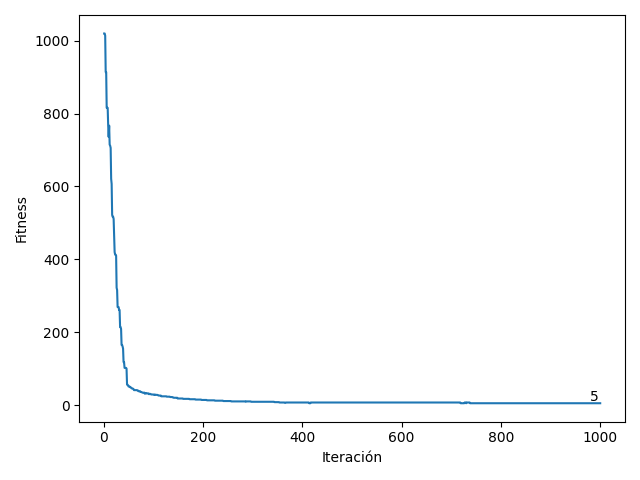{width=60%}

En cuanto a la comparativa entre el mejor individuo de la población inicial y el individuo final, se puede ver como han desaparecido los huecos sin clase y se han eliminado en mayor parte la repetición de una misma asignatura el mismo día.

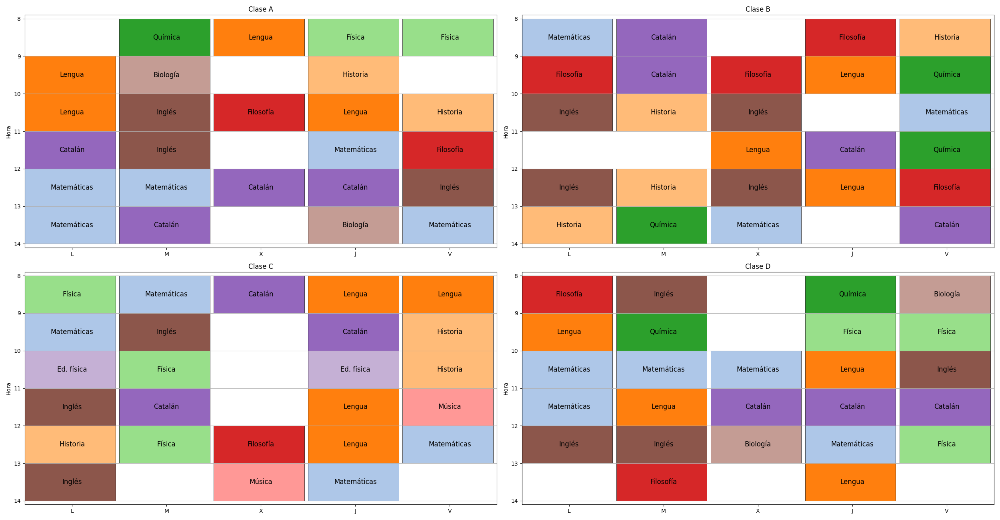

\newpage

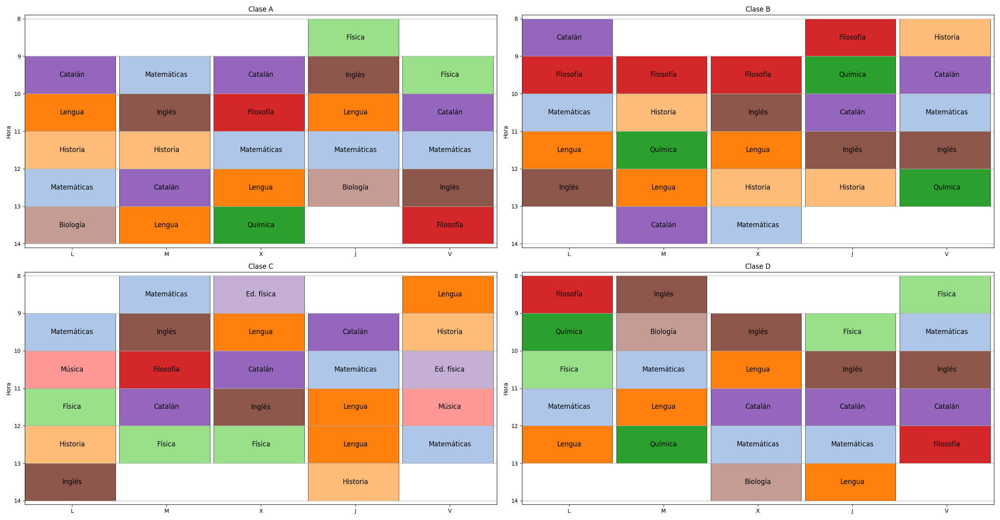

Y sobre la comparativa de los horarios de los profesores entre el mejor individuo de la población inicial y el individuo final, ver como se ha conseguido evitar el solapamiento, se ha conseguido que el profesor dé todas sus clases de forma seguida y que el número de horas de clase sea uniforme durante todos los días de la semana.

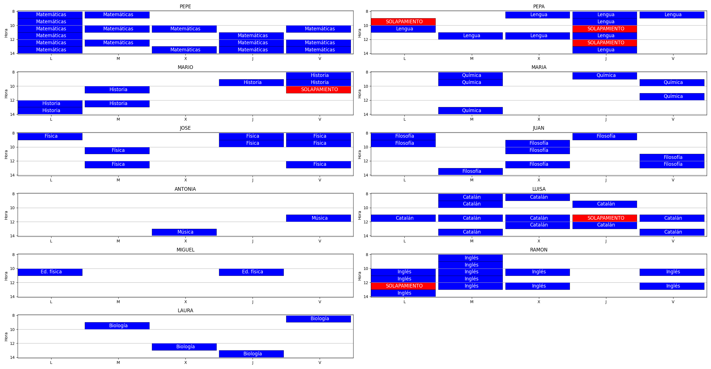

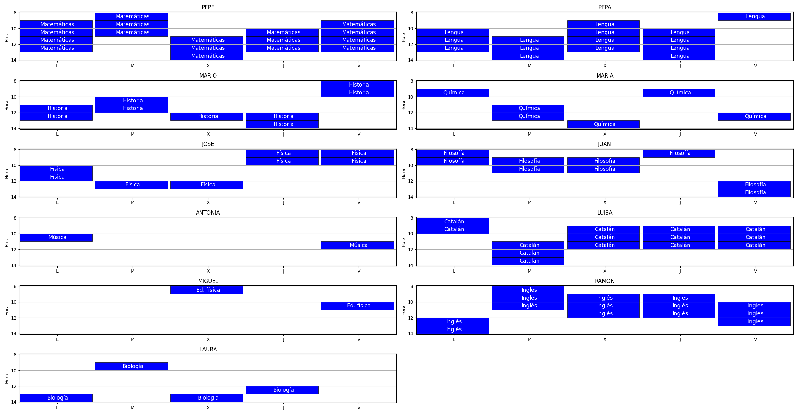

\newpage

### 3.2 Entrada 2

El segundo conjunto de inputs utilizado es prácticamente igual al anterior con la única diferencia de que en este caso los profesores no tienen un disponibilidad horaria completa por lo que habrá días en los que no podrán ejercer.

El resultado obtenido ha sido de un valor de fitness de 15. En este caso, no se ha infringido ninguna restricción hard pero si han infringido algunas restricciones soft como son las restricciones 1, 2, 4 y 5 un total de 2, 4, 5 y 4 veces respectivamente.

Ver en las siguientes imágenes de los horarios iniciales y finales de clases y profesores como, además de todas las mejoras vistas en la entrada anterior respecto al primer individuo y el individuo final, también se puede apreciar como los días marcados en verde, los cuales indican que el profesor no tiene disponibilidad, no se han asignado ninguna hora de clase ese día. 

{width=85%}


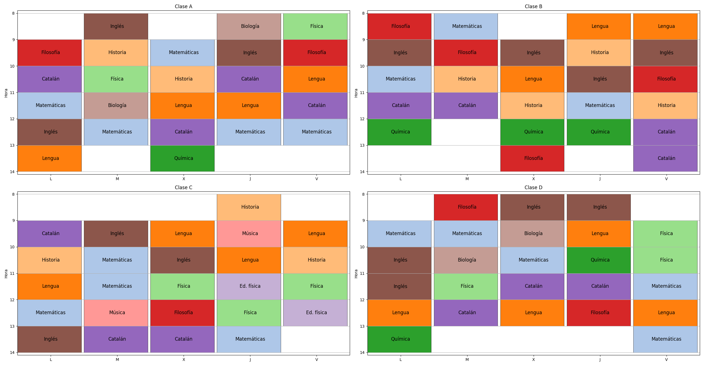{width=85%}

\newpage

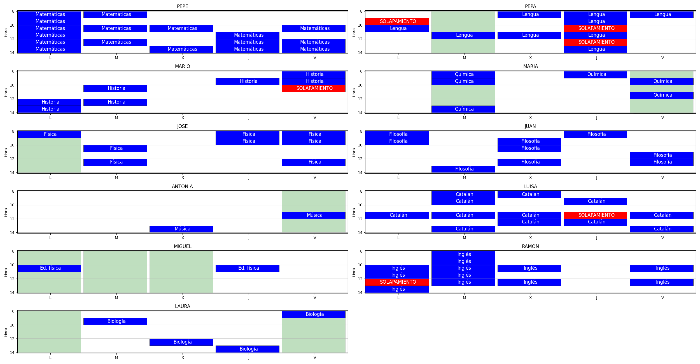{width=80%}

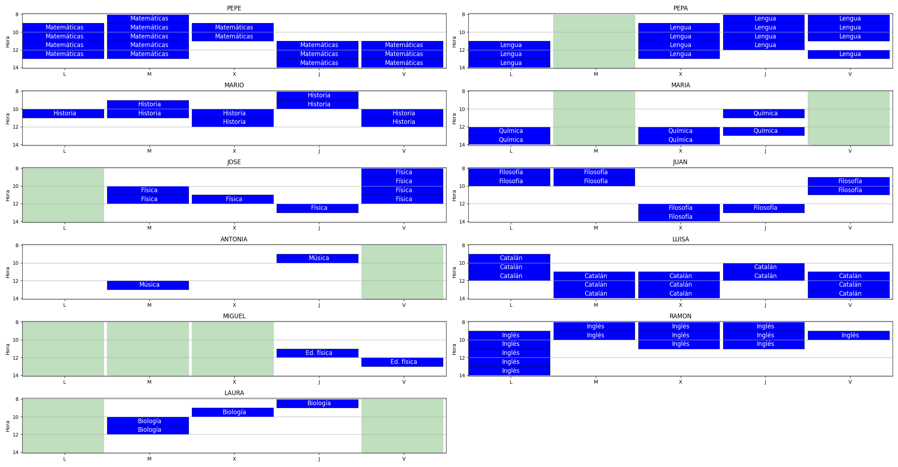{width=80%}

\newpage

### 3.3 Entrada 3

El tercer conjunto de inputs utilizado va destinado a asignar muchas horas a cada uno de los profesores para poder visualizar las restricciones propias de los profesores. Este conjunto de entrada está compuesto por:

* 5 profesores que pueden dar diferentes asignaturas a diferentes clases
* 4 grupos de clase con el mismo número de horas de clase cada uno
* 12 asignaturas
* Los profesores hay días en los que no tienen disponibilidad
* El horario lectivo es de 8h a 14h toda la semana

El valor de fitness obtenido ha sido de 21. Las restricciones infringidas, únicamente soft, han sido la restricción 1 solo 1 vez, la restricción 2 un total de 2 veces, la restricción 4 un total de 10 veces y la restricción 5 un total de 8 veces. 

Además, indicar, tal como se ve en la figura 13, como al ser menos profesores que la entradas anteriores se ha tenido que ajustar en gran medida los horarios de los profesores pero siempre respetando los días que no tienen disponibilidad.

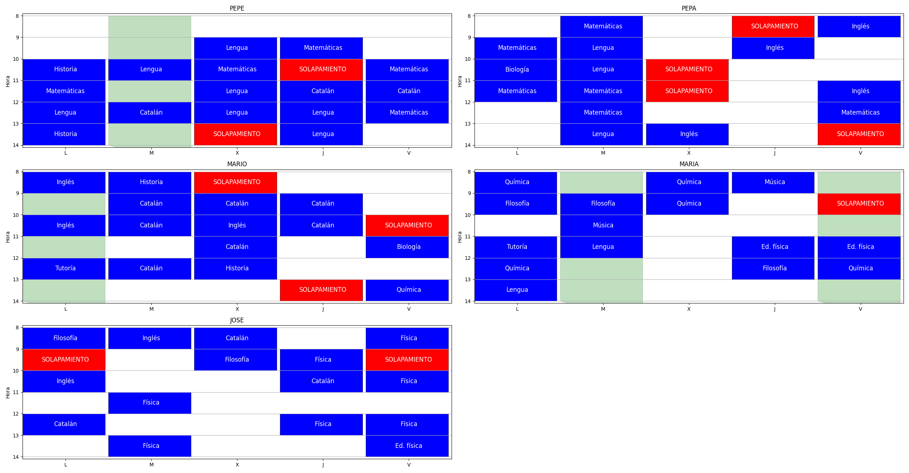

\newpage

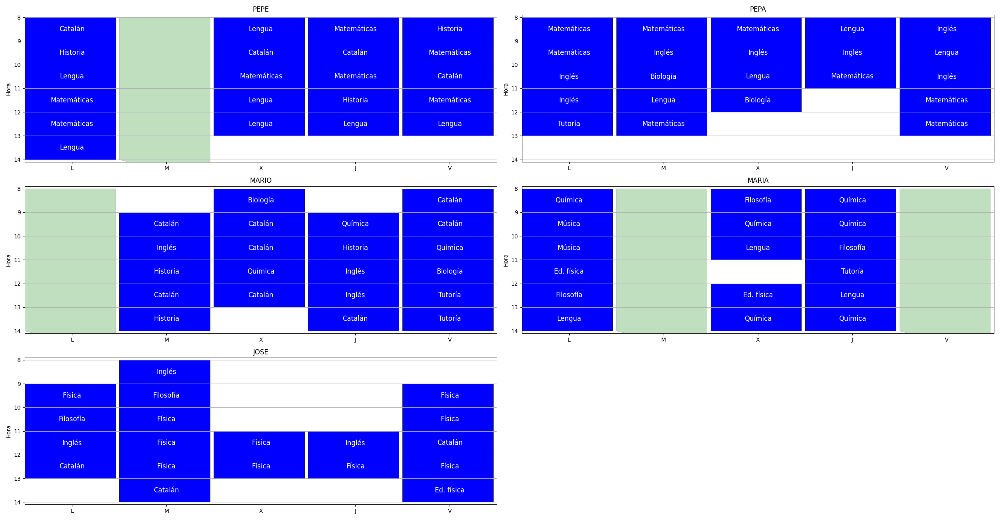

### 3.4 Entrada 4

El cuarto conjunto de inputs utilizado está compuesto por:

* 11 profesores que pueden dar diferentes asignaturas a diferentes clases
* 4 grupos de clase con diferente número de horas de clase cada uno
* 12 asignaturas
* Los profesores hay días en los que no tienen disponibilidad
* El horario lectivo es de 8-14h el lunes, de 8-15h los martes, miércoles y jueves y de 8-13h los viernes

El valor de fitness obtenido ha sido 31 y se han infringido todas las restricciones del tipo soft un total de 1, 6, 2, 11 y 11 veces en dicho orden.Y pudiéndose ver la recombinación de las diferentes clases según el número de horas que se imparten en cada una de ellas.

\newpage

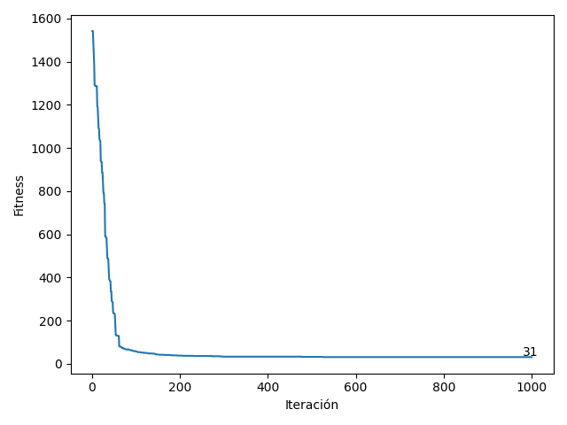{width=55%}

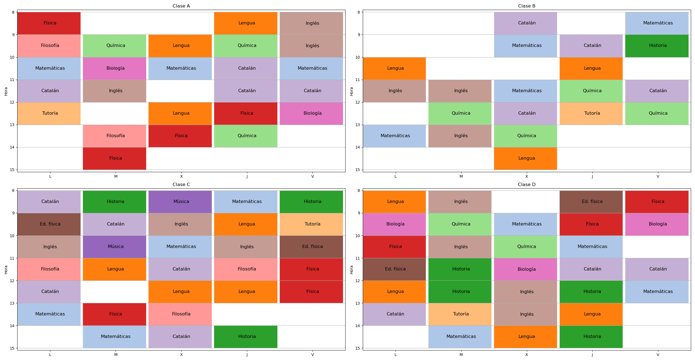{width=85%}

\newpage

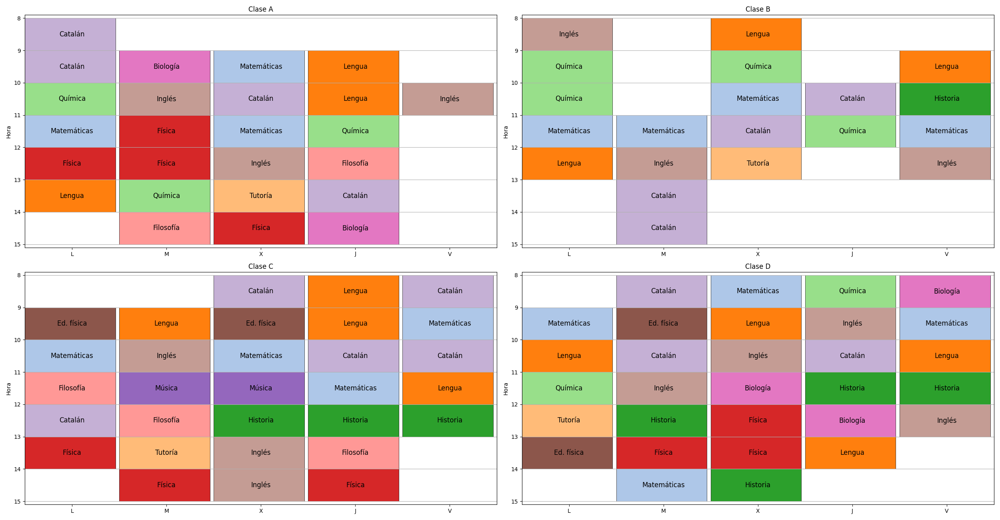

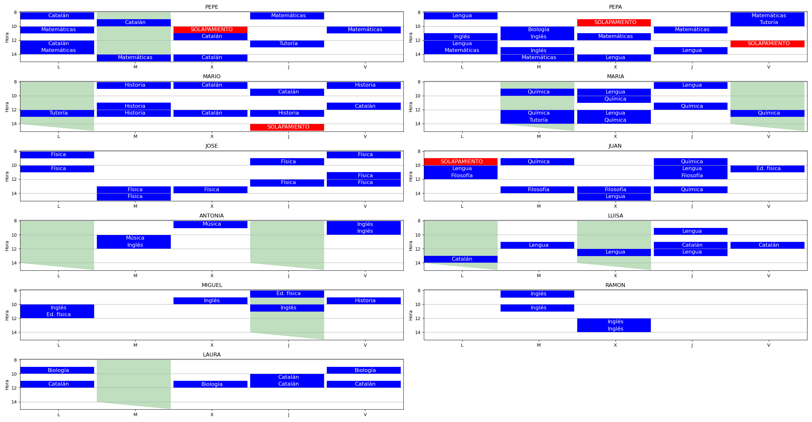
\newpage 

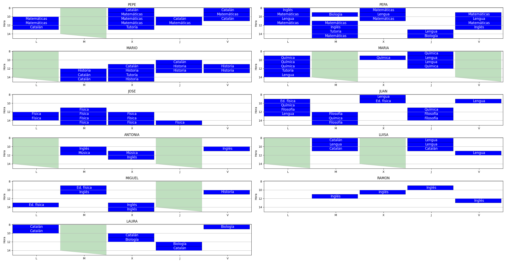


## 4. Modificaciones del algoritmo

### 4.1 Modificaciones propuestas

En esta sección proponemos una serie de potenciales mejoras para el algoritmo, y comprobamos su efectividad. La efectividad se comprueba comparando el *fitness* de la solución final con el algoritmo "original", con el fitness de la solución final obtenida tras los cambios aquí descritos. Esta comparación se puede hacer gracias al uso que hacemos en el código de *seeds* que garantizan que la población inicial y las partes del algoritmo no modificadas dan resultados exactamente iguales que en la sección anterior.

**Modificaciones en la selección de supervivientes**

Se proponen dos nuevas técnicas de selección de supervivientes:

-**Modificación 1**: Selección totalmente aleatoria donde no se tiene en cuenta el valor de fitness. Es importante destacar que esta modificación no hace que la población deje de tender hacia individuos con mejor fitness a medida que se suceden las iteraciones. Esto es así porque aunque con esta modificación la selección de supervivientes es aleatoria, la selección de padres sigue estando sesgada hacia los individuos con mejor fitness. Y como los padres son los que se combinan y los que mutan, cuando toca seleccionar supervivientes, hay una sobre representación de individuos parecidos a los padres, que tienen mejor fitness que la media de la población.

-**Modificación 2**: Técnica de selección del muestreo universal estocástico (SUS) desarrollado por James Baker. Esta técnica es similar a la técnica de selección de la ruleta empleada en el algoritmo original. Ambas técnicas utilizan los valores de fitness para definir el tamaño de la "porción de la ruleta" que corresponde a cada individuo, de modo que es más probable escoger un individuo con un fitness mejor. Sin embargo, la diferencia que existe entre ambas técnicas es que la técnica de la ruleta realiza *n* tiradas obteniendo cada vez un individuo, mientras que la técnica SUS únicamente realiza una tirada para definir el punto de la ruleta a partir del cual "recorre" la ruleta en intervalos uniformes seleccionando un individuo en cada intervalo. 

**Modificaciones del operador de recombinación**

Se proponen dos nuevas técnicas de recombinación:

-**Modificación 3**: El operador anteriormente implementado elegía de forma aleatoria las clases que que pertenecían a un padre o al otro, sin embargo, este operador realiza la recombinación siempre del mismo modo, la primera mitad de clases serán de un padre y la segunda mitad del otro.

-**Modificación 4**: En este caso se crea un hijo que contiene "lo mejor" de cada padre. Para ello se calcula el *fitness* de cada padre a nivel clase y el *Hijo 1* toma la mejor clase de cada par de clases. Por ejemplo, si el fitness del la *'Clase A'* del *Padre 1* es 38 y el fitness de la 'Clase A' del *Padre 2* es 32, el horario de la *'Clase A'* en el *Hijo 1* será el del *Padre 2*. Con este operador también se crea el *Hijo 2* como complementario del 1, así que en este caso el *Hijo 2* tendrá "lo peor" de cada padre. La limitación de esta modificación es que no se pueden calcular todas las restricciones a nivel clase ya que también está la dimensión profesor (por ejemplo la restricción de que los profesores tengan los huecos distribuidos uniformemente a lo largo de la semana). De hecho, en muchas ocasiones observamos que el fitness total del *Hijo 1* (que se supone que tiene lo mejor de cada padre), es peor que el de cualquiera de los padres, ya que remplazar el horario de una clase por otra impacta negativamente en el fitness del horario semanal del profesor.

**Modificaciones del operador de mutación**

-**Modificación 5**: En este caso, en lugar de elegir una clase y una franja aleatoriamente para permutar por otra, la selección de la clase sigue siendo aleatoria pero dentro de la clase se elige una franja en el "peor día" (dentro de ese día la selección es aleatoria). Para ello se calcula el *fitness* a nivel día para la clase seleccionada. La limitación de esta modificación es que no se pueden calcular todas las restricciones a nivel clase-día ya que muchas son a nivel profesor y otras a nivel semana (por ejemplo la de tener huecos uniformemente distribuidos). 

### 4.2 Resultados

A continuación se muestra el fitness resultante de aplicar cada modificación al algoritmo original de forma independiente (es decir, sin combinar modificaciones), y la posición en la que queda cada modificación. 

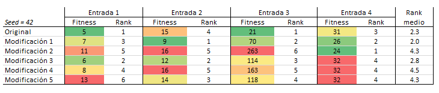

Como se puede observar, no hay ninguna modificación que consistentemente supere al algoritmo original. De hecho el algoritmo original acaba en segunda posición, sólo superado por la modificación que selecciona supervivientes de forma aleatoria. La razón por la que esta modificación funciona puede tener que ver con el motivo que nos llevó a incluirla, y es que observábamos que a partir de cierto número de iteraciones, todos los individuos de la población eran idénticos o muy parecidos. Nuestra interpretación es que esta "tendencia a la endogamia" hace que las soluciones converjan hacia un mínimo local relativamente cercano a la población inicial, impidiendo que se exploren otras zonas del espacio de soluciones que puede que contengan mejores mínimos. Una selección aleatoria de individuos hace que esta convergencia hacia mínimos locales sea más lenta, permitiendo explorar otras zonas del espacio de soluciones que, como se ve en los resultados, resultan en un *fitness* mejor.

Una pregunta interesante es cómo de dependientes son estos resultados de la población inicial generada de forma aleatoria. Si realizamos el mismo análisis pero con otra *seed*, obtenemos los siguientes resultados.

\newpage

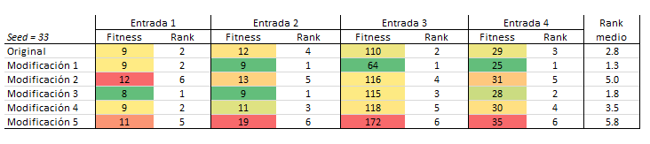

Se puede observar como la modificación 2 sigue siendo la que mejor resultados da. Aunque en este caso la modificación 3 también supera al algoritmo original.


